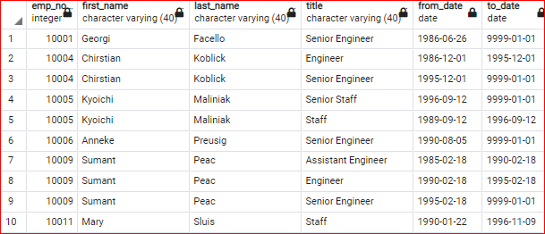
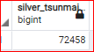
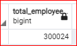
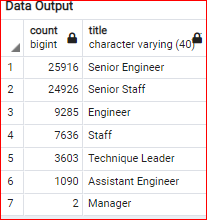
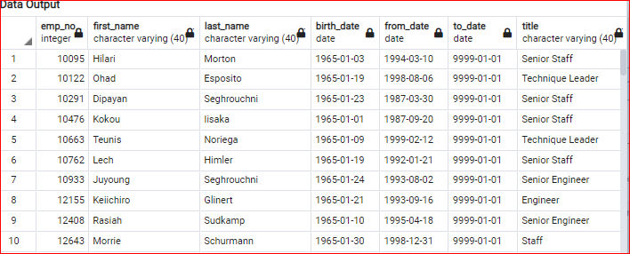
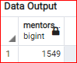
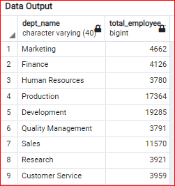
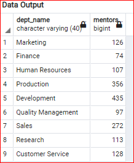

# Overview of the analysis:
Wrote query to create table of current employees with their title who are going to retire (those born between 01-01-1952 to 12-31-1955). 
Wrote query to create table of unique retiring employees (removing the duplicate employees). 
Wrote query to create mentorship-eligibility table for those born between 01-01-1965 to 12-21-1965).

## Results:
* There are 72,458 employees who are in the 'Silver Tsunami' group.

* 25% of people of the total employee are in the 'Silver Tsunami' group.

&nbsp;&nbsp;

* Senior Engineers & Senior Staff combined are 70% of the total Silver Tsunami group'.

* There are 1,549 eligible mentors.

 

## Summary
* 72,458 postions need to be filled as silver tsunami employees retire over 3 years.

* There are not enough qualified, retirement-ready employees in the departments to mentor the next generation of Pewlett Hackard employees . There are just 1549 eligible mentors to train the new employees, assuming all the retiring position(72,458) are going to be filled.

Created new query to get the number of retirees by department. This will give better idea to department heads to dertermine how many employees need to be hired.

* Created another query to get the total number of mentors by department. This will give a better idea if more mentors have to be added in any particular department( by creating the query over two years range)

